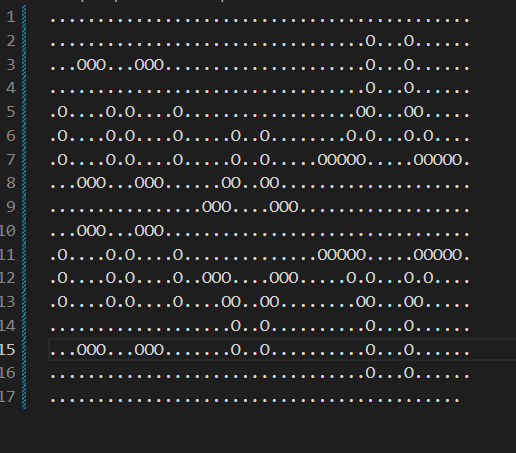
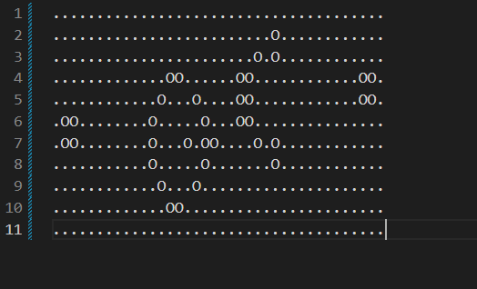
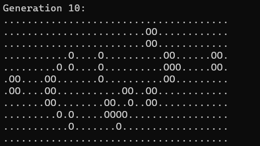
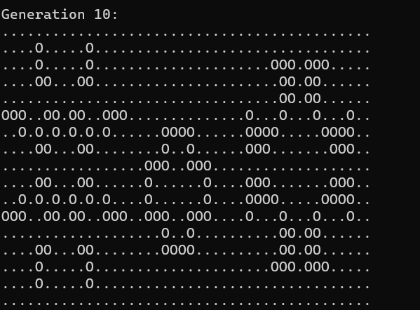

# Game Of Life - MPI  🕹️🧬
Implementazione del modello matematico *Game of life* (John Conway - 1970) con linguaggio C e OpenMPI.

----
🎓 Università degli Studi di Salerno  
💻 Dipartimento di Informatica  
📚 Programmazione Parallela e Concorrente su Cloud 2022/2023

----
👤 Francesco Pio Covino


## Soluzione proposta
Game of life è un modello matematico creato da John Conway nel 1970.
La seguente è un'implentazione in C con l'utilizzo di OpenMPI. La soluzione proposta si può sintetizzare nei seguenti punti:

N.B. Nella spiegazione verrà preso in esame il caso in cui l'utente ha scelto la dimensione della matrice (NxM) e il numero di iterazioni.

- La matrice viene allocata in porzioni di memoria contigue e quindi è fisicamente un array ma viene trattata logicamente come una matrice.

- La comunicazione fra processi è ad anello o toroidale, il successore del processo con rank *n-1* avrà rank *0* e di conseguenza il predecessore del processo con rank *0* avrà rank *n-1*.

- La matrice *NxM* viene allocata dal processo MASTER ed inizializzata da tutti i *P* processi. Ogni processo inizializza un insieme di righe, di default saranno *N/numero_di_processi* ma in caso di divisione non equa le righe in più vengono ridistribuite. Le righe inizializzate vengono poi re-inviate al processo MASTER attraverso l'uso della routine `MPI_Gatherv`.

- La matrice inizializzata viene suddivisa in modo equo tra tutti i processi, MASTER compreso, attraverso la routine `MPI_Scatterv`.

- I processi, in modalità asincrona, eseguono le seguenti operazioni:
    - calcolano il rank del proprio successore e predecessore nell'anello.
    - inviano (`MPI_Isend`) la loro prima riga al loro predecessore e la loro ultima riga al loro successore.
    - Si preparano a ricevere (`MPI_Irecv`) la riga di bordo superiore dal loro predecessore e la riga di bordo inferiore dal loro successore.
    - Mentre attendono le righe di bordo, iniziano ad eseguire l'algoritmo di GoL nelle zone della matrice in cui gli altri processi non sono coinvolti (tutte le righe escluse la prima e l'ultima).
    - Ricevute le righe di bordo, i processi eseguono l'algoritmo anche sulle celle che necessitano dell'utilizzo di quest'ultime.

- Le righe risultanti vengono re-inviate al MASTER attraverso l'uso della routine `MPI_Gatherv`.

## Dettagli Implementativi
Di seguito alcuni degli aspetti più importanti dell'implementazione.

In base al numero di argomenti inseriti dall'utente, viene scelto la variante da eseguire: nel primo caso il processo master riempie la matrice da file, nel secondo caso le dimensioni sono scelte dall'utente e nel terzo sono quelle di default.
```c
switch (argc)
    {
    case 3: /* l'utente ha indicato un pattern da file */
        is_file = true;
        if (rank == MASTER) {
            /* preparazione file */
            dir = "patterns/";
            filename = argv[1];
            ext = ".txt";
            file = malloc(strlen(dir) + strlen(filename) + strlen(ext) + 1);
            sprintf(file, "%s%s%s", dir, filename, ext);
            printf("--Generate matrix seed from %s--\n", file);
            /* il processo master imposta le dimensioni della matrice in base al file di input */
            check_matrix_size(file, &row_size, &col_size);
        }
        /* master invia la size della matrice a tutti i processi */
        MPI_Bcast(&row_size, 1, MPI_INT, MASTER, MPI_COMM_WORLD);
        MPI_Bcast(&col_size, 1, MPI_INT, MASTER, MPI_COMM_WORLD);
        iterations = atoi(argv[2]);
        break;
    case 4: /* le dimensioni sono scelte dall'utente */
        row_size = atoi(argv[1]);
        col_size = atoi(argv[2]);
        iterations = atoi(argv[3]);
        break;
    case 1: /* esegue l'algoritmo con le configurazioni di default */
        row_size = DEF_ROWS;
        col_size = DEF_COLS;
        iterations = DEF_ITERATION;
        break;
    default:
        printf("Error, check the number of arguments.\n");
        MPI_Finalize();
        return 0;
        break;
    }
```  
Viene creato un nuovo tipo di dato MPI replicando `MPI_CHAR` col_size (col_size indica il numero di colonne della matrice) volte in posizioni contigue. Permette di migliorare le prestazioni nel passaggio di dati di grandi dimensioni.
```c
MPI_Type_contiguous(col_size, MPI_CHAR, &mat_row);
MPI_Type_commit(&mat_row);
```

La matrice viene equamente divisa tra i processi, nel caso di divisione non equa, i primi processi ricevono una riga in più.
```c
/* ogni cella k memorizza il numero di righe assegnate al processo k */
rows_for_proc = calloc(num_proc, sizeof(int));
/* ogni cella k memorizza il displacement da applicare al processo k */
displacement = calloc(num_proc, sizeof(int));
/* divisione delle righe */
int base = (int)row_size / num_proc;
int rest = row_size % num_proc;
/* righe già assegnate */
int assigned = 0;

/* calcolo righe e displacement per ogni processo */
for (int i = 0; i < num_proc; i++) {
  displacement[i] = assigned;
  /* nel caso di resto presente, i primi resto processi ricevono una riga in più*/
  if (rest > 0) {
    rows_for_proc[i] = base + 1;
    rest--;
  } else {
    rows_for_proc[i] = base;
  }
  assigned += rows_for_proc[i];
}
```

Ogni processo alloca la sua porzione di righe, calcolate nella fase precedente:
```c
result_buff = calloc(rows_for_proc[rank] * col_size, sizeo(char));
```  

Ogni processo inizializza le celle delle sue righe (ALIVE o DEAD) in modo casuale e le invia al processo MASTER. La routine `MPI_Gatherv` raccoglie i dati da tutti i processi e li concatena nel buffer del processo MASTER.
```c
MPI_Gatherv(result_buff, rows_for_proc[rank], mat_row, matrix, rows_for_proc, displacement, mat_row, MASTER, MPI_COMM_WORLD);
```

Ogni processo alloca i propri buffer:
  1. un buffer per la ricezione della sottomatrice
  2. un buffer per memorizzare la nuova matrice a seguito del calcolo della nuova generazione
  3. un buffer per ricevere la riga precedente alle proprie
  4. un buffer per ricevere la riga successiva alle proprie
```c
recv_buff = calloc(rows_for_proc[rank] * col_size, sizeof(char));
result_buff = calloc(rows_for_proc[rank] * col_size, sizeof(char));
prev_row = calloc(col_size, sizeof(char));
next_row = calloc(col_size, sizeof(char));
```

Le seguenti porzioni di codice vengono eseguite per un numero I di iterazioni scelte dall'utente. 

La matrice, precedentemente inizializzata, viene distribuita a tutti i processi con la routine `MPI_ScatterV`.
```c
MPI_Scatterv(matrix, rows_for_proc, displacement, mat_row, recv_buff, rows_for_proc[rank], mat_row, MASTER, MPI_COMM_WORLD); 
```

Ogni processo, in modalità asincrona, attraverso le routine `MPI_Isend` e `MPI_Irecv`:
  1. invia al suo predecessore la sua prima riga
  2. si mette in attesa della riga precedente alla sua
  3. invia al suo successore la sua ultima riga
  4. attende la riga successiva 
```c
MPI_Isend(recv_buff, 1, mat_row, prev, TAG_NEXT, MPI_COMM_WORLD, &send_request);
MPI_Irecv(prev_row, 1, mat_row, prev, TAG_PREV, MPI_COMM_WORLD, &prev_request);
MPI_Isend(recv_buff + (col_size * (sub_rows_size - 1)), 1, mat_row, next, TAG_PREV, MPI_COMM_WORLD, &send_request);
MPI_Irecv(next_row, 1, mat_row, next, TAG_NEXT, MPI_COMM_WORLD, &next_request);  
```

Ogni processo calcola il valore delle celle che non necessitano dati utilizzati da altri processi. Vengono pertanto escluse la prima riga e l'ultima. Per ogni cella target vengono calcolati i vicini ALIVE nell'intorno (le 8 celle che lo racchiudono). Il dato appena calcolato viene poi utilizzato per calcolare il nuovo valore della cella. 
```c
void compute(char* origin_buff, char* result_buff, int row_size,  int col_size) {
    for (int i = 1; i < row_size - 1; i++) {
            for (int j = 0; j < col_size; j++) {

                /* memorizza i vicini vivi nell'intorno della cella target */
                int live_count = 0;
                for (int row = i - 1; row < i + 2; row++) {
                    for (int col = j - 1; col < j + 2; col++) {
                        if (row == i && col == j) {
                            continue;
                        }
                        if (origin_buff[row * col_size + (col % col_size)] == ALIVE) {
                            live_count++;
                        }       
                    }
                }
                /* decide lo stato della cella per la generazione successiva */
                life(origin_buff, result_buff, i * col_size + j, live_count);
            }
        }
}
```

Nello specifico la funzione `life()` controlla le 3 casistiche con un semplice If-Else: una cellula ALIVE con 2 o 3 vicini ALIVE sopravvive per la prossima generazione, se è DEAD e ha 3 vicini ALIVE diventa ALIVE nella prossima generazione altrimenti in tutti i restanti casi il suo stato è DEAD.
```c
void life(char *origin, char *result, int index, int live_count) {
    if (origin[index] == ALIVE && (live_count == 2 || live_count == 3)) {
        result[index] = ALIVE;        
    } else if (origin[index] == DEAD && live_count == 3) {
        result[index] = ALIVE; 
    } else {
        result[index] = DEAD; 
    }           
}
```

Prima di calcolare i valori delle celle che necessitano dell'aiuto degli altri processi, si attende il completamento e la ricezione delle righe di bordo con la routine `MPI_Waitany`.
```c
MPI_Request to_wait[] = {prev_request, next_request};
int handle_index;
MPI_Waitany(2, to_wait, &handle_index, &status);
```

Una volta completate entrambe le richieste, vengono calcolati i valori delle celle utilizzando le righe di frontiera appena ricevute. La riga -1 identifica la riga precedente ricevuta dal processo precedente. Per raggiungere lo scopo basterà controllare la riga precedente e le prime due assegnate al processo corrente. Vengono calcolati i vicini ALIVE nell'intorno della cella target ed eseguito il calcolo per identificare il suo stato nella successiva generazione.
```c
void compute_prev(char* origin_buff, char* result_buff, char* prev_row,  int col_size) {
    for (int j = 0; j < col_size; j++) {
        int live_count = 0;
        
        for (int row = -1; row < 2; row++) {
            for (int col = j - 1; col < j + 2; col++) { 
                if (row == 0 && col == j)
                    continue;
                /* controlla la riga precedente */
                if (row == -1) {
                    if (prev_row[col % col_size] == ALIVE)
                        live_count++;
                } else { /* altrimenti controlla nella sotto-matrice */
                    if (origin_buff[row * col_size + (col % col_size)] == ALIVE)
                        live_count++;
                }
            }
        }
        /* decide lo stato della cella */
        life(origin_buff, result_buff, j, live_count);
    }
}
```
Vengono poi calcolati i valori delle righe superiori. La riga row_size identifica la riga successiva ricevuta dal processo successivo. Per raggiungere lo scopo basterà controllare le ultime due righe e quella successiva.
```c
void compute_next(char* origin_buff, char* result_buff, char* next_row, int row_size, int col_size) {
    for (int j = 0; j < col_size; j++) {
        int live_count = 0;
        for (int row = row_size - 2; row < row_size + 1; row++) {
            for (int col = j - 1; col < j + 2; col++) {
                /* se sto analizzando la cella corrente continuo */
                if (row == row_size - 1 && col == j)
                    continue;
                /* controlla la riga successiva o la matrice in base al caso */
                if (row == row_size) {
                    if (next_row[col % col_size] == ALIVE)
                        live_count++;
                } else {
                        if (origin_buff[row * col_size + (col % col_size)] == ALIVE)
                            live_count++;
                }
            }
        }
        /* decide lo stato della cella nella posizione indicata */    
        life(origin_buff, result_buff, (row_size - 1) * col_size + j, live_count);
    }
}
```

Le righe, con i valori aggiornati per la prossima generazione, vengono re-inviate al processo padre e concatenate nella matrice con la routine `MPI_Gatherv`:
```c
MPI_Gatherv(result_buff, rows_for_proc[rank], mat_row, matrix, rows_for_proc, displacement, mat_row, MASTER, MPI_COMM_WORLD);
```

## Compilazione ed esecuzione 
Sono presenti due versioni dell'algoritmo, una versione sequenziale ed una parallela, entrambe utilizzano OpenMPI. La versione sequenziale utilizza OpenMPI solo per far in modo che la misurazione dei tempi sia svolta nel medesimo modo.

<details>
  <summary><b>GoL versione sequenziale</b></summary>

Per la compilazione eseguire il seguente comando da terminale:  

```c
mpicc -o gol sequential_gol.c
```
Per l'esecuzione esistono due varianti:

La prima variante permette di inizializzare la matrice seed con un pattern memorizzato su file. Il file pattern va inserito in formato plain text (.txt) nella directory *patterns/*. Una cella della matrice indicata come viva conterrà il simbolo *O* mentre se indicata come morta conterrà il simbolo *"."*; I seguenti sono due esempi di pattern:

Pulsar pattern             |  Glidergun pattern
:-------------------------:|:-------------------------:
  |   

Oltre al nome del file va specificato il numero di iterazioni da eseguire:
```c
mpirun -n 1 gol pulsar 10
```  
La seconda variante permette di eseguire l'algoritmo specificando 3 argomenti:
- numero di processi
- numero di righe
- numero di colonne
- numero di iterazioni  

N.B. La matrice di partenza verrà generata in maniera casuale.
```c
mpirun -n 1 gol 100 200 8
```  
  
</details>

<details>
    <summary><b>GoL versione parallela</b></summary>

Per la compilazione eseguire il seguente comando da terminale:  

```c
mpicc -o mpigol mpi_gol.c
```  
Per l'esecuzione esistono 3 varianti:

La prima variante permette di inizializzare la matrice seed con un pattern memorizzato su file. Il file pattern va inserito in formato plain text (.txt) nella directory *patterns/*. Una cella della matrice indicata come viva conterrà il simbolo *O* mentre se indicata come morta conterrà il simbolo *"."*; I seguenti sono due esempi di pattern:

Pulsar pattern             |  Glidergun pattern
:-------------------------:|:-------------------------:
  |   

Oltre al nome del file va specificato il numero di iterazioni da eseguire e il numero di processi da utilizzare:
```c
mpirun -n 5 mpigol pulsar 10
```  
La seconda variante permette di eseguire l'algoritmo specificando 3 argomenti:
- numero di processori
- numero di righe
- numero di colonne
- numero di iterazioni  

N.B. La matrice di partenza verrà generata in maniera casuale.
```c
mpirun -n 5 mpigol 100 200 8
``` 
La terza variante non richiede alcun argomento aggiuntivo ed eseguirà l'algoritmo utilizzando i parametri di default (una matrice 240x160 su 6 iterazioni), riempendo la matrice con valori casuali.
```c
mpirun -n 5 mpigol
```  

</details>

## Correttezza
Per dimostrare la correttezza della soluzione sono stati utilizzati due pattern noti, *pulsar* e *glidergun*. 

| Pulsar | GliderGun |
| --- | --- |
|  |  |

Il risultato è stato confrontato con una simulazione testabile [qui](https://conwaylife.com/). Il programma è stato eseguito per un numero fisso di iterazioni pari a 10 e variando il numero di processi utilizzati. Di seguito i risultati:


**Risultati Pattern GliderGun**
| ver. sequenziale | 2 processi | 4 processi | 8 processi |
| --- | --- | --- | --- |
|  |  |  |  |

**Risultati Pattern Pulsar**
| ver. sequenziale | 2 processi | 4 processi | 8 processi |
| --- | --- | --- | --- |
|  |  |  |  |

Tutti i test, dopo le 10 iterazioni prefissate, restituiscono lo stesso risultato confermando la correttezza della soluzione indipendentemente dal numero di processi utilizzati. 

## Analisi performance
Le prestazioni sono state valutate su un cluster Google di 4 nodi e2-standard-4 con 4vCPU in termini di scalabilità forte e di scalabilità debole. 

### Scalabilità forte
Lo scaling forte riguarda lo speedup per una dimensione fissa del problema rispetto al numero di processori. Per il test le dimensioni della matrice di partenza sono state fissate a 6000 righe e 6000 colonne e a variare sarà il numero di processori utilizzati. Il numero di iterazioni è stato fissato a 100.

| # Processori | Dim. matrice | Tempi di esecuzione (ms) |
| --- | --- | --- |
| 1 | 6000 x 6000 | 0.1 |
| 2 | 6000 x 6000 | |
| 3 | 6000 x 6000 | |
| 4 | 6000 x 6000 | |
| 5 | 6000 x 6000 | |
| 6 | 6000 x 6000 | |
| 7 | 6000 x 6000 | |
| 8 | 6000 x 6000 | |
| 9 | 6000 x 6000 | |
| 10 | 6000 x 6000 | |
| 11 | 6000 x 6000 | |
| 12 | 6000 x 6000 | |
| 13 | 6000 x 6000 | |
| 14 | 6000 x 6000 | |
| 15 | 6000 x 6000 | |
| 16 | 6000 x 6000 | |


### Scalabilità debole
Lo scaling debole riguarda lo speedup per un problema di dimensioni scalari rispetto al numero di processori. Il numero di processori è stato fissato a 8 e il numero di iterazioni a 100. A variare sono le dimensioni della matrice di partenza.

| # Processori | Dim. matrice | Tempi di esecuzione (ms) |
| --- | --- | --- |
| 8 | 1000 x 1000 | 0.1 |
| 8 | 2000 x 2000 | |
| 8 | 4000 x 4000 | |
| 8 | 6000 x 6000 | |
| 8 | 8000 x 8000 | |
| 8 | 16000 x 16000 | |

## Conclusioni
motivazioni performance ottenute