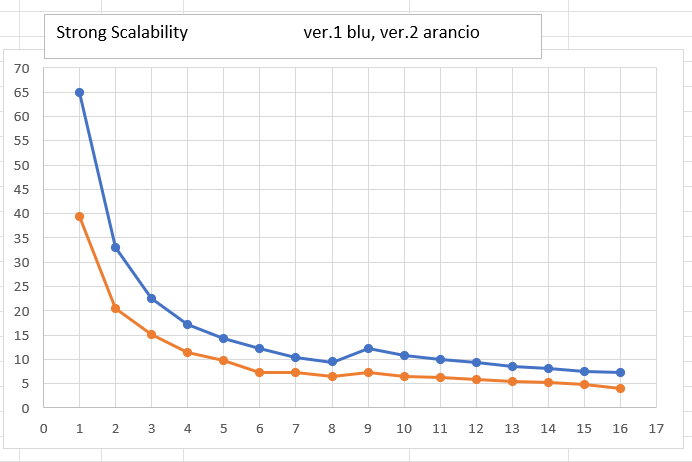
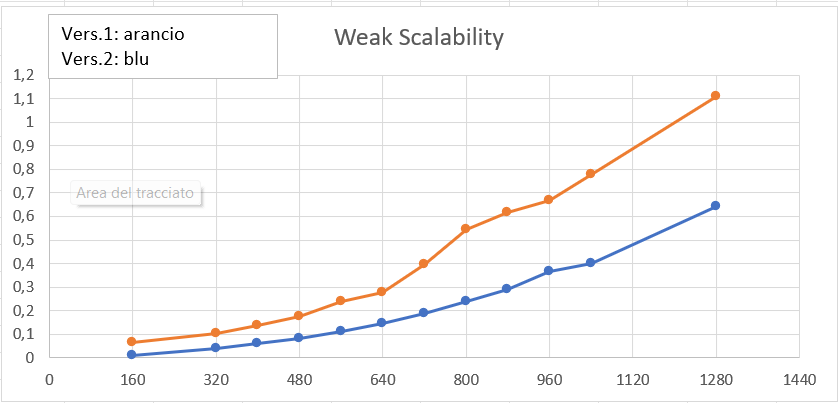

# Game Of Life - MPI  🕹️🧬
Implementazione del modello matematico *Game of life* (John Conway - 1970) con linguaggio C e OpenMPI.

----
🎓 Università degli Studi di Salerno  
💻 Dipartimento di Informatica  
📚 Programmazione Parallela e Concorrente su Cloud 2022/2023

----
👤 Francesco Pio Covino


## Soluzione proposta
Game of life è un modello matematico creato da John Conway nel 1970.
La seguente è un'implentazione in C con l'utilizzo di MPI ed OpenMPI. La soluzione proposta si può sintetizzare nei seguenti punti:

- La matrice viene allocata in porzioni di memoria contigue e quindi fisicamente è un array ma viene trattata logicamente come una matrice.

- La comunicazione fra processi segue il pattern ad anello o toroidale, il successore del processo con rank *n-1* avrà rank *0* e di conseguenza il predecessore del processo con rank *0* avrà rank *n-1*.

- La matrice viene suddivisa in modo equo tra tutti i processi, MASTER compreso. Ad ogni processo vengono assegnate `row_size/num_proc` righe, tranne nel caso di resto presente: i primi 'resto' processi ricevono una riga in più.

- Ogni processo alloca la propria porzione di righe e la inizializza con valori casuali (ALIVE o DEAD).

- Vengono utilizzati due puntatori: `process_buffer` e `result_buffer`. Il primo punta alla porzione di righe inizializzata dal processo mentre il secondo punta alla porzione di memoria che conterrà i nuovi valori dopo l'esecuzione di GameOfLife. Prima di ogni iterazione, i due puntatori vengono scambiati per memorizzare i valori di partenza della successiva generazione.  

- Per un numero di volte pari al numero di generazioni scelto, ogni processo esegue le seguenti operazioni:
    - controlla, secondo la generazione corrente, quale spazio di memoria viene utilizzato per il calcolo e quale per memorizzare i dati
    - invia in modalità asincrona (`MPI_Isend`) la sua prima riga al predecessore e la sua ultima riga al successore.
    - si prepara a ricevere in modalità asincrona (`MPI_Irecv`) la riga di bordo superiore dal suo predecessore e la riga di bordo inferiore dal suo successore.
    - mentre attende le righe di bordo, esegue l'algoritmo di GameofLife nelle zone della matrice in cui gli altri processi non sono coinvolti (essenzialmente tutte le righe escluse la prima e l'ultima).
    - ricevute le righe di bordo, il processo esegue l'algoritmo anche sulle celle che necessitano dell'utilizzo di quest'ultime. 

## Dettagli Implementativi
Di seguito alcuni degli aspetti più importanti dell'implementazione.

#### Analisi degli argomenti
In base al numero di argomenti inseriti dall'utente, viene scelto la variante da eseguire: 
- nel primo caso il processo MASTER riempie la matrice iniziale con un file pattern e ad ogni iterazione viene mostrata a video
- nel secondo caso le dimensioni sono scelte dall'utente
- nel terzo caso è sempre l'utente a scegliere le dimensioni ma la matrice viene stampata ad ogni iterazione
- nell'ultimo caso vengono utilizzate le dimensioni di default
```c
switch (argc) {  
    case 3: /* l'utente ha indicato un pattern da file */
        is_file = true;
        if (rank == MASTER) {
            /* preparazione file */
            dir = "patterns/";
            filename = argv[1];
            ext = ".txt";
            file = malloc(strlen(dir) + strlen(filename) + strlen(ext) + 1);
            sprintf(file, "%s%s%s", dir, filename, ext);
            printf("--Generate game matrix seed from %s--\n", file);
            /* il processo master calcola le dimensioni della matrice in base al file */
            check_matrix_size(file, &row_size, &col_size);
        }
        /* MASTER invia la size della matrice a tutti i processi */
        MPI_Bcast(&row_size, 1, MPI_INT, MASTER, MPI_COMM_WORLD);
        MPI_Bcast(&col_size, 1, MPI_INT, MASTER, MPI_COMM_WORLD);
        generations = atoi(argv[2]);
        break;    
    case 4: /* le dimensioni sono scelte dall'utente */
        row_size = atoi(argv[1]);
        col_size = atoi(argv[2]);
        generations = atoi(argv[3]);
        break;
    case 5: /* le dimensioni sono scelte dall'utente e la matrice viene stampata ad ogni iterazione */
        if(strcmp(argv[4], "test") == 0) {
           is_test = true; 
        }
        row_size = atoi(argv[1]);
        col_size = atoi(argv[2]);
        generations = atoi(argv[3]);
        break;    
    case 1: /* configurazioni di default */
        row_size = DEF_ROWS;
        col_size = DEF_COLS;
        generations = DEF_ITERATION;
        break;
    default:
        printf("Error, check the number of arguments.\n");
        MPI_Finalize();
        return 0;
        break;
    }
```  

#### Nuovo tipo di dato MPI
Viene creato un nuovo tipo di dato MPI replicando `MPI_CHAR` col_size  volte in posizioni contigue (col_size indica il numero di colonne della matrice). La contiguità permette di gestire ogni riga come un unico elemento nel passaggio dei dati.
```c
MPI_Type_contiguous(col_size, MPI_CHAR, &mat_row);
MPI_Type_commit(&mat_row);
```
#### Divisione del carico
La matrice viene equamente divisa, per numero di righe, tra i processi. Nel caso di divisione non equa, i primi resto processi ricevono una riga in più.
```c
/* ogni cella i memorizza il numero di righe assegnate al processo i-esimo */
    rows_for_proc = calloc(num_proc, sizeof(int));
    /* ogni cella i memorizza il displacement da applicare al processo i-esimo */
    displ_for_proc = calloc(num_proc, sizeof(int));
    
    /* divisione delle righe */
    int base = (int)row_size / num_proc;
    int rest = row_size % num_proc;
    /* righe già assegnate */
    int assigned = 0;

    /* calcolo righe e displacement per ogni processo */
    for (int i = 0; i < num_proc; i++) {
        displ_for_proc[i] = assigned;
        /* nel caso di resto presente, i primi resto processi ricevono una riga in più*/
        if (rest > 0) {
            rows_for_proc[i] = base + 1;
            rest--;
        } else {
            rows_for_proc[i] = base;
        }
        assigned += rows_for_proc[i];
    }
```

Ogni processo alloca la sua porzione di righe, il cui numero è stato calcolato nella fase precedente e le inizializza con valori casuali:
```c
    process_buffer = calloc(rows_for_proc[rank] * col_size, sizeo(char));

    srand(time(NULL) + rank);
    for(int i = 0; i < rows_for_proc[rank] * col_size; i++) {
        if (rand() % 2 == 0) {
            process_buffer[i] = ALIVE;
        } else {
            process_buffer[i] = DEAD;
        }
    }  
```  

Ogni processo calcola il rank del processo che lo precede e lo succede nell'anello:
```c
    prev_rank = (rank - 1 + num_proc) % num_proc;
    next_rank = (rank + 1) % num_proc;
```

Ogni processo alloca i propri buffer:
  1. un buffer per memorizzare il calcolo della nuova generazione delle righe
  2. un buffer per effettuare lo scambio sopra spiegato
  3. un buffer per ricevere la riga precedente alle proprie
  4. un buffer per ricevere la riga successiva alle proprie
```c
    result_buffer = calloc(rows_for_proc[rank] * col_size, sizeof(char));
    char *temp; /* per lo scambio di puntatori */
    prev_row = calloc(col_size, sizeof(char));
    next_row = calloc(col_size, sizeof(char));
```
#### Calcolo delle generazioni
Le seguenti porzioni di codice vengono eseguite per un numero X di iterazioni scelte dall'utente:

Prima dell'effettivo calcolo, vengono controllati i puntatori, per la prima iterazione non viene fatto alcuno scambio. Dalla seconda in poi `process_buffer` e `result_buffer` vengono scambiati. Lo scambio permette di avere sempre a disposizione la generazione precedente per il calcolo della generazione successiva.
```c
    if(gen > 0) {
        if( gen%2 == 0) {
            temp = result_buffer;
            result_buffer = process_buffer;
            process_buffer = temp;
        } else {
            temp = process_buffer;
            process_buffer = result_buffer;
            result_buffer = temp;
        }
    }
```

Ogni processo, in modalità asincrona, attraverso le routine `MPI_Isend` e `MPI_Irecv`:
  1. invia al suo predecessore la sua prima riga
  2. si mette in attesa della riga precedente alle sue
  3. invia al suo successore la sua ultima riga
  4. attende la riga successiva alle sue 
```c
    /* rank invia la sua prima riga al processo precedente */
    MPI_Isend(process_buffer, 1, row_data, prev_rank, TAG_PREV, MPI_COMM_WORLD, &send_request);
    MPI_Request_free(&send_request);

    /* rank riceve la riga precedente dal suo predecessore */
    MPI_Irecv(prev_row, 1, row_data, prev_rank, TAG_NEXT, MPI_COMM_WORLD, &prev_request);

    /* rank invia la sua ultima riga al suo successore */
    MPI_Isend(process_buffer + (col_size * (rows_for_proc[rank] - 1)), 1, row_data, next_rank, TAG_NEXT, MPI_COMM_WORLD, &send_request);
    MPI_Request_free(&send_request);

    /* rank riceve la riga successiva dal suo successore */
    MPI_Irecv(next_row, 1, row_data, next_rank, TAG_PREV, MPI_COMM_WORLD, &next_request);       
```

Ogni processo calcola il valore delle celle che non necessitano dei valori posseduti da altri processi. Vengono pertanto escluse la prima riga e l'ultima. Per ogni cella target vengono calcolati i vicini ALIVE nell'intorno (le 8 celle che lo racchiudono). Il dato appena calcolato viene poi utilizzato per calcolare il nuovo valore della cella. 
```c
void compute(char* origin_buff, char* result_buffer, int row_size,  int col_size) {
    for (int i = 1; i < row_size - 1; i++) {
            for (int j = 0; j < col_size; j++) {

                /* memorizza i vicini vivi nell'intorno della cella target (i,j) */
                int live_count = 0;
                for (int row = i - 1; row < i + 2; row++) {
                    for (int col = j - 1; col < j + 2; col++) {
                        if (row == i && col == j) {
                            continue;
                        }
                        if (origin_buff[row * col_size + (col % col_size)] == ALIVE) {
                            live_count++;
                        }       
                    }
                }
                
                /* decide lo stato della cella per la generazione successiva */
                life(origin_buff, result_buffer, i * col_size + j, live_count);
            }
    }
}
```

Nello specifico la funzione `life()` controlla le 3 casistiche con un semplice If-Else: una cellula ALIVE con 2 o 3 vicini ALIVE sopravvive per la prossima generazione, se è DEAD e ha 3 vicini ALIVE diventa ALIVE nella prossima generazione. Altrimenti in tutti i restanti casi il suo stato è DEAD.
```c
void life(char *origin, char *result, int index, int live_count) {
    if (origin[index] == ALIVE && (live_count == 2 || live_count == 3)) {
        result[index] = ALIVE;        
    } else if (origin[index] == DEAD && live_count == 3) {
        result[index] = ALIVE; 
    } else {
        result[index] = DEAD; 
    }           
}
```

Prima di calcolare i valori delle celle che necessitano delle righe degli altri processi, si attende il completamento e la ricezione delle righe di bordo con la routine `MPI_Waitany`.
```c
MPI_Request to_wait[] = {prev_request, next_request};
int handle_index;
MPI_Waitany(2, to_wait, &handle_index, &status);
```

Una volta completate entrambe le richieste, vengono calcolati i valori delle celle mancanti utilizzando le righe di frontiera appena ricevute. La riga -1 identifica la riga precedente ricevuta dal processo predecessore. Per raggiungere lo scopo basterà controllare la riga precedente e le prime due assegnate al processo corrente. Vengono calcolati i vicini ALIVE nell'intorno della cella target ed eseguito il calcolo per identificare il suo stato nella successiva generazione.
```c
void compute_prev(char* origin_buff, char* result_buff, char* prev_row,  int col_size) {
    for (int j = 0; j < col_size; j++) {
        int live_count = 0;
        
        for (int row = -1; row < 2; row++) {
            for (int col = j - 1; col < j + 2; col++) { 
                if (row == 0 && col == j)
                    continue;
                /* controlla la riga precedente */
                if (row == -1) {
                    if (prev_row[col % col_size] == ALIVE)
                        live_count++;
                } else { /* altrimenti controlla nella sotto-matrice */
                    if (origin_buff[row * col_size + (col % col_size)] == ALIVE)
                        live_count++;
                }
            }
        }
        /* decide lo stato della cella */
        life(origin_buff, result_buff, j, live_count);
    }
}
```
Allo stesso modo vengono poi calcolati i valori delle righe superiori. La riga row_size identifica la riga successiva ricevuta dal processo successore. Per raggiungere lo scopo basterà controllare le ultime due righe e quella successiva dapprima controllando i vicini ALIVE nell'intorno e poi eseguendo la funzione `life()`.
```c
void compute_next(char* origin_buff, char* result_buff, char* next_row, int row_size, int col_size) {
    for (int j = 0; j < col_size; j++) {
        int live_count = 0;
        for (int row = row_size - 2; row < row_size + 1; row++) {
            for (int col = j - 1; col < j + 2; col++) {
                /* se sto analizzando la cella corrente continuo */
                if (row == row_size - 1 && col == j)
                    continue;
                /* controlla la riga successiva o la matrice in base al caso */
                if (row == row_size) {
                    if (next_row[col % col_size] == ALIVE)
                        live_count++;
                } else {
                        if (origin_buff[row * col_size + (col % col_size)] == ALIVE)
                            live_count++;
                }
            }
        }
        /* decide lo stato della cella nella posizione indicata */    
        life(origin_buff, result_buff, (row_size - 1) * col_size + j, live_count);
    }
}
```
Completato il calcolo per ogni cella, l'algoritmo ripete i passaggi sopra per X volte.

## Compilazione ed esecuzione 
Per la compilare il programma eseguire il seguente comando da terminale:  

```c
mpicc -o gol mpi_gol.c
```  
Per l'esecuzione esistono 3 varianti:

La prima variante permette di inizializzare la matrice seed con un pattern memorizzato su file. Il file pattern va inserito in formato plain text (.txt) nella directory *patterns/*. Una cella della matrice indicata come ALIVE conterrà il simbolo *''O''* mentre se indicata come DEAD conterrà il simbolo *''.''*. I seguenti sono due esempi di pattern:

Pulsar pattern             |  Glidergun pattern
:-------------------------:|:-------------------------:
  |   

Oltre al nome del file senza estensione, va specificato il numero di iterazioni da eseguire e il numero di processi da utilizzare, come nell'esempio:
```c
mpirun -n 4 gol pulsar 10
```  
La seconda variante permette di eseguire l'algoritmo specificando 4 argomenti:
- numero di processori
- numero di righe
- numero di colonne
- numero di iterazioni  

N.B. La matrice di partenza verrà generata in maniera casuale.
```c
mpirun -n 4 gol 100 200 8
```
Nel caso si voglia mostrare a video la matrice di gioco dopo ogni iterazione, va aggiunta la flag *test* come nell'esempio di seguito:
```c
mpirun -n 4 gol 10 20 8 test
```

La terza variante non richiede alcun argomento aggiuntivo oltre al numero di processori da utilizzare ed eseguirà l'algoritmo settando i parametri di default (una matrice 240x160 su 10 iterazioni), riempendo la matrice con valori casuali.
```c
mpirun -n 4 mpigol
```  

## Correttezza
Per dimostrare la correttezza della soluzione sono stati utilizzati due pattern noti, *pulsar* e *glidergun*. 

| Pulsar | GliderGun |
| --- | --- |
|  |  |

Il risultato è stato confrontato con una simulazione testabile [qui](https://conwaylife.com/). Il programma è stato eseguito per un numero fisso di iterazioni pari a 10 e variando il numero di processi utilizzati. Di seguito i risultati:

**Risultati Pattern GliderGun**
| 1 processo | 2 processi |
| --- | --- |
|  |  |

| 4 processi | 8 processi |
| --- | --- |
|  |  |

**Risultati Pattern Pulsar**
| 1 processo | 2 processi |
| --- | --- |
|  |  |

| 4 processi | 8 processi |
| --- | --- |
  |  |

Tutti i test, dopo le 10 iterazioni prefissate, restituiscono lo stesso risultato confermando la correttezza della soluzione indipendentemente dal numero di processi utilizzati.

## Analisi performance
Le prestazioni sono state valutate su un cluster GoogleCloud di 4 nodi e2-standard-4 con 4vCPU (16 vCPU in totale) in termini di scalabilità forte e di scalabilità debole. Per i test sono state utilizzate matrici quadrate per una questione di semplicità. Sono stati eseguite due fasi di test: la prima fase di misurazione è stata svolta su una prima versione dell'algoritmo che utilizzava routine `MPI_Scatterv` e  `MPI_Gatherv` per aggregare la matrice e ridistribuirla ad ogni iterazione; la seconda versione è più performante in quanto ogni processo gestisce in maniera indipendente la sua porzione di matrice.

## Scalabilità forte
La scalabilità forte riguarda lo speedup per una dimensione fissa del problema rispetto al numero di processori. Per il test le dimensioni della matrice di partenza sono state fissate a 4000 righe e 4000 colonne e a variare sarà il numero di processori utilizzati (da 1 a 16). Il numero di iterazioni è stato fissato a 50. I tempi di esecuzione sono stati calcolati su una media di 3 esecuzioni. Di seguito i risultati in formato tabellare:

### Tabella Versione 1 & Versione 2
| # Processori | Dim. matrice (R=C) | Tempi ver.1 (ms) | Speedup ver.1 | Tempi vers.2 (ms) | Speedup vers.2 |
| --- | --- | --- | --- | --- | --- |
| 1 | 4000 | 64,89 | // | 39,34 | // |
| 2 | 4000 | 32,95 | 1,96 | 20,40 | 1,97 |
| 3 | 4000 | 22,46 | 2,88 | 15,15 | 2,89 |
| 4 | 4000 | 17,20 | 3,77 | 11,40 | 3,86 |
| 5 | 4000 | 14,20 | 4,56 | 9,68 | 4,75 |
| 6 | 4000 | 12,20 | 5,31 | 7,33 | 5,42 |
| 7 | 4000 | 10,31 | 6,29 | 7,01 | 6,25 |
| 8 | 4000 | 9,46 | 6,85 | 6,44 | 7,0 |
| 9 | 4000 | 12,27 | 5,28 | 7,23 |	6,32 |
| 10 | 4000 | 10,80 | 6,00 | 6,38 |	6,16 |
| 11 | 4000 | 10,01 | 6,48 | 6,24 |	6,29 |
| 12 | 4000 | 9,43 | 6,88 | 5,82 | 6,75 |
| 13 | 4000 | 8,60 | 7,53 | 5,45 | 7,20 |
| 14 | 4000 | 8,15 | 7,95 | 5,31 | 7,40 |
| 15 | 4000 | 7,59 | 8,54 | 4,85 | 8,10 |
| 16 | 4000 | 7,39 | 8,77 | 4,09 | 9,77 |

Di seguito invece il grafico che mostra il rapporto fra i tempi di esecuzione (ordinata) e il numero di processori utilizzati (ascissa). Le due versioni dell'algoritmo sono state confrontate, si evince subito che la versione 2 risulta essere più veloce. Inizialmente il tempo di esecuzione scende vertiginosamente fino a stabilizzarsi dagli 8 processori in poi, la differenza tra i due tende ad essere costante.



Nel grafico sotto invece viene mostrato come varia lo speedup (ordinata) al crescere dei processori (ascissa) utilizzati per le due versioni. Inizialmente lo speedup cresce in maniera ottimale fino ad un anomalo calo su 9 processori per poi ri-stabilizzarsi con una crescita più lenta. Lo speedup delle due versioni cresce in maniera quasi lineare e sembra equivalersi tranne per alcuni picchi.


## Scalabilità debole
Lo scaling debole riguarda lo speedup per un problema di dimensioni scalari rispetto al numero di processori. Il numero di processori è stato fissato a 8 e il numero di iterazioni a 50. A variare sono le dimensioni della matrice di partenza. Dopo ogni test aumenta il numero di righe e colonne gestite dal singolo processo (aggiunte 10 righe e 10 colonne).
Di seguito i risultati sotto forma di tabella:

| # Processori | Dim. matrice (R=C) | Tempi ver.1 (ms) | Tempi ver.2 (ms) | 
| --- | --- | --- | --- |
| 8 | 160 | 0.6420 | 0.0090 |
| 8 | 320 | 0.1048 | 0.0417 |
| 8 | 400 | 0.1382 | 0.0609 |
| 8 | 480 | 0.1760 | 0.0834 |
| 8 | 560 | 0.2381 | 0.1135 |
| 8 | 640 | 0.2771 | 0.1470 |
| 8 | 720 | 0.3966 | 0.1888 |
| 8 | 800 | 0.5469 | 0.2402 |
| 8 | 880 | 0.6190 | 0.2884 |
| 8 | 960 | 0.6670 | 0.3658 |
| 8 | 1040 | 0.7797 | 0.4021 |
| 8 | 1280 | 1.1082 | 0.6445 |

Il grafico mostra il rapporto tra il tempo di esecuzione (ordinata) e la dimensione della matrice quadrata (ascissa). Le due versioni mostrano entrambe una crescita esponenziale, si nota che la seconda versione è più veloce della prima:



## Conclusioni
Come mostrato nei risultati, la soluzione proposta scala discretamente bene. I processi lavorano parallelamente e in maniera indipendente dalla prima fase dell'algoritmo, il riempimento della matrice, fino alla fase di calcolo della generazione successiva.

Per quanto riguarda la scalabilità forte, i risultati ottenuti sono inizialmente ottimi, i tempi diminuiscono, quasi dimezzano e lo speedup tende a quello ideale. Dall'utilizzo di otto processori in poi i tempi si stabilizzano e lo speedup migliora meno velocemente. Una stabilizzazione che si può imputare anche alla dimensione dell'input, non abbastanza grande per 8 processi, o all'overhead di comunicazione. Sulla base di alcuni test effettuati in locale con la medesima taglia del problema, è possibile affermare che l'overhead di comunicazione causato dall'utilizzo di un cluster remoto è impattante sui tempi di computazione, è quindi fondamentale tenere in considerazione questo particolare nella valutazione delle performance.

In termini di scalabilità debole, il programma ha ottenuto le performance attese. Per natura dell'algoritmo la computazione sfrutta molto le risorse in termini di CPU, vengono infatti analizzate indipendentemente tutte le celle della matrice e per ogni cella l'intorno. L'aumento della taglia della matrice fa diminuire di conseguenza le performance.

La prima versione, con l'utilizzo di `MPI_Scatterv` e `MPI_Gatherv` con cui il  processo MASTER raccoglieva i dati e li ridistribuiva ad ogni iterazione, risulta meno efficiente e più lenta della seconda versione dove ogni processo lavora autonomamente comunicando con gli altri processi solo per lo scambio di righe necessarie. Il risultato del confronto si evince sia dalle tabelle che dai grafici sopra.  
